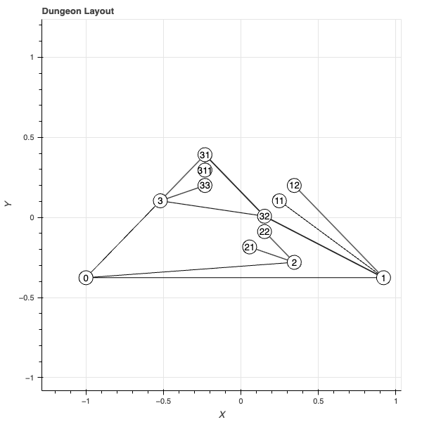
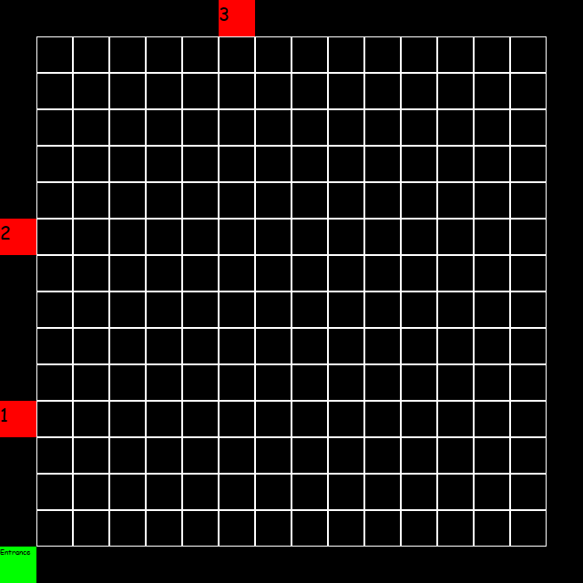
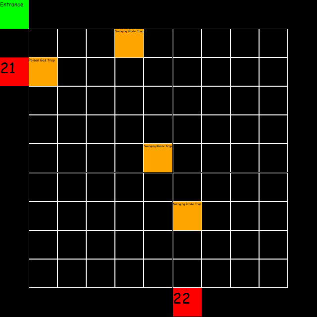

I have made this as a map generator for the table top game Dungeons and Dragons.
This generates a planar drawing of a graph map in bokeh. 
Rooms are generated from the nodes within the graph and assigned types: monster, trap, shrine, boss, vault, shop.
Traps are generated from within the trap room where the data is from the traps.json file.
Monsters are generated within the monster room where the data is from the bestiary.csv file. This was downloaded from this site: https://5e.tools/bestiary.html#aarakocra_mm

# Example Generation.
## Graph generation.

This graph is first generated. Each node is assigned a room type from global variables. This is used when generating the room maps and information. Node generation is done by determining how many children each node should have. This is done by having a random integer chosen between 1 and the complexity of the dungeon. The depth determines when the iteration of the node generation finishes. 

Once the graph hits the nodes at the max depth a boss room will attempt to spawn as the final node. If this is successful a vault room will be created immediately after the boss with only one connection to the boss. This marks the last step in generating the initial graph. 

The next step is to add extra edges between nodes/ rooms. This creates a more natural feeling dungeon as well as adding some paths between the trees avoiding having to run all the way back up to explore a different branch. A node is not allowed to connect to the another room if it is a vault. This is to force having to encounter the boss before getting into the vault to make the dungeon more challenging and interesting.

The graph is fully done. This will be the layout for the dungeon. Rooms will now be generated.

## Room generation.
### Initial generation.
Just before rooms are generated, defining who the boss of the dungeon will make the dungeon easier to create. This enables that the monsters and, if required, the traps to have a theme depending upon the boss. For example, if the the boss is an undead create then only undead monsters will be added to the dungeon giving an undead theme. 

### Room initialisation.
Room generation begins by creating a DungeonRoom for each node. Each room has the following information: 
- size: how large the room is. Defined in the globals. Chosen depending on the difficulty of the dungeon. Higher difficulty -> bigger rooms.
- neighbours: used to create the entrance and exits within the map.
- difficulty: used to determine the challenge rating of monsters.
- room_type: entrance, shop, boss, vault, monster, trap, shrine.
- boss of the dungeon: defined for creating monsters and themes within the room. 

### Room creation.
A room will look like the following:

If the room is a trap it will look like the following:

If the room type is 'trap' then the traps will be generated and placed within the room. Trap locations are determined by the entrance, exits and the center of the room. They are placed within a random spread around these locations to give variability and reduce predictibility. These wont be shown to the players and are a reference for the game master to use. 

If the room is not a 'trap' then it is one of the others. Information of these (and for the traps) is logged into the dungeon_info.txt file.

For monsters:

*Room 1*
*Room Size: (5, 5)*
*Room Type: monster*
*Monsters: Constructed Commoner, Replica Tridrone, Homunculus, Crystal Battleaxe, Homunculus, Demos Magen, Strixhaven Campus Guide, Swarm of Mechanical Spiders, Stone Giant Statue, Animated Armor, Stone Giant Statue, Demos Magen,*

For traps:

*Room 2*
*Room Size: (10, 10)*
*Room Type: trap*
*Trap: Swinging Blade Trap*
*A swinging blade trap is a large blade that swings down from the ceiling or up from the floor when triggered. The blade is usually razor-sharp and can cut through flesh and bone with ease.*
*2d10 slashing damage*
*Dexterity DC 15*

*Trap: Swinging Blade Trap*
*A swinging blade trap is a large blade that swings down from the ceiling or up from the floor when triggered. The blade is usually razor-sharp and can cut through flesh and bone with ease.*
*2d10 slashing damage*
*Dexterity DC 15*

*Trap: Swinging Blade Trap*
*A swinging blade trap is a large blade that swings down from the ceiling or up from the floor when triggered. The blade is usually razor-sharp and can cut through flesh and bone with ease.*
*2d10 slashing damage*
*Dexterity DC 15*

*Trap: Poison Gas Trap*
*A poison gas trap is a hidden mechanism that releases a cloud of poisonous gas when triggered. The gas is usually colorless and odorless, making it difficult to detect until it is too late.*
*2d6 poison damage*
*Constitution DC 15*

For shops:

(this is from another dungeon. This example one didn't generate a shop)

*Room 1* 
*Room Size: (5, 5)*
*Room Type: shop*
*Shop Items: Lance: 10 gp, Bombard: 50,000 gp, Sleep Grenade: nan, Turtle Ship: 40,000 gp, Trinket: nan, Chicken: 2 cp, Claw of the Wyrm Rune: 4000, Potion of Heroism: 4000,*

For bosses:

*Room 31*
*Room Size: (10, 10)*
*Room Type: boss*
*Boss: Helmed Horror*
*Minions: Constructed Commoner, Animated Broom,*

For vaults:

*Room Size: (5, 5)*
*Room Type: vault*
*Gold: {'copper': 485, 'silver': 992, 'gold': 42, 'platinum': 9}*
*Gems: {'worth': 825, 'type': 'Sardonyx'}*
*Magic Items: ['Pixie Dust' 1500]*

For shrines:
Shrines do not have any information as they are a custom thing I am adding for my own games. This will be updated later but isn't important for the actual dungeon as the goal was traps, monsters and treasure.

